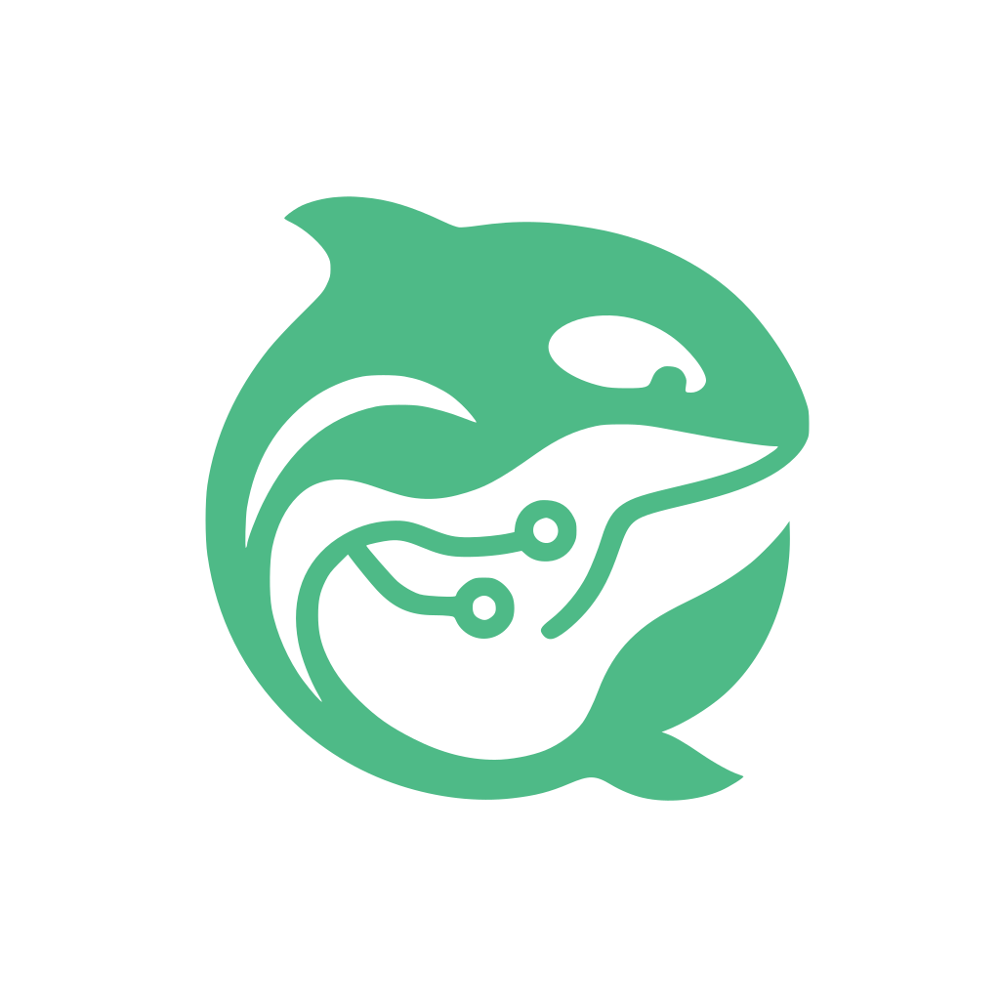

<p align="center">
  
</p>

<h1 align="center">Keiko</h1>

<p align="center"><strong>Ex experientia disco</strong></p>

<p align="center">
  Keiko is a governed agentic workspace for knowledge work that learns from experience.
</p>

<p align="center">
  <a href="LICENSE"></a>
  <a href="package.json"></a>
  <a href="package.json"></a>
  <a href="https://github.com/oscharko-dev/Keiko/actions/workflows/ci.yml"></a>
  <a href="https://github.com/oscharko-dev/Keiko/actions/workflows/codeql.yml"></a>
  
  
</p>

<p align="center">
  <a href="#quickstart">Quickstart</a>
  ·
  <a href="#core-workflows">Workflows</a>
  ·
  <a href="#security-boundaries">Security</a>
  ·
  <a href="CONTRIBUTING.md">Contributing</a>
  ·
  <a href="SECURITY.md">Security policy</a>
</p>

## Overview

Keiko starts with local developer-assist workflows for regulated engineering teams. It helps inspect a repository, chat with configured language models, generate reviewable unit tests, investigate bugs, run verification, and keep redacted evidence for human review.

Keiko is human-controlled by design. It does not commit, push, open pull requests, merge code, or apply changes without an explicit local action. The manifest-producing surfaces emit redacted evidence for audit.

## Vision

Keiko's long-term direction is a governed workspace where people can delegate knowledge work to learning agents without giving up control, oversight, or accountability.

- **Governed delegation:** agents start with a task, not standing rights.
- **Harness-first control:** agent actions, tool calls, connector access, approvals, failures, and outcomes flow through one observable control layer.
- **Keiko Twin:** a governed work representative that can build controlled memory about user preferences, project routines, accepted outcomes, and recurring corrections.
- **Learning from experience:** Keiko should improve future tool selection, escalation, policy suggestions, and workflow quality from structured evidence and feedback.
- **Enterprise boundaries:** learning can improve suggestions and routines, but it must never grant itself authority or bypass human and organizational policy.

Software engineering is the first use case because repositories, tests, reviews, and tool calls create hard evidence. The product direction is broader: a controlled agentic workspace for enterprise knowledge work.

## Report bugs and findings

If you find a defect while using Keiko, open a GitHub issue with the structured [User-Finding form](https://github.com/oscharko-dev/Keiko/blob/dev/.github/ISSUE_TEMPLATE/user_finding.yml). Do not open a blank issue for reproducible bug intake.

The form captures version, platform, reproduction steps, expected behavior, actual behavior, impact, environment, and redacted evidence. Do not include API keys, customer data, private screenshots, internal model endpoints, private logs, or other secrets.

## Quickstart
## What's New in 0.2.0

### Quality Intelligence

A native Workspace window that turns connected requirement sources into reviewable, evidence-backed test-case candidates. Open **Quality Intelligence** from the left rail, connect sources the same way Chat does — a single Fachkonzept file, folders, Knowledge Capsules, or a Figma snapshot, up to 16 at once — and press **Generate**. Quality Intelligence persists a redacted, integrity-hashed evidence manifest for each run. You get a coverage Gap Radar with per-requirement excerpts, a bidirectional requirement↔test traceability matrix (CSV/Markdown), drift detection with targeted regeneration ("Living Tests"), an optional adversarial test-quality judge, inline candidate editing, and export to PDF, Markdown, plain text, or a ZIP bundle. Quality Center export is a dry-run preview by design; live writes are rejected.

Model use is capability-routed and optional: with no model configured, the structural stages still produce a deterministic baseline run.

### Figma design connector

Connect a Figma board read-only with a personal access token. The token is encrypted at rest with the same AES-256-GCM vault primitive as memory — the vault key comes from the macOS keychain, an environment variable, or a `0600` keyfile — and is never written to config files or logs. Keiko builds a deterministic clean Snapshot — screens, text, design tokens, navigation links — that can feed Quality Intelligence for design-to-tests, an accessibility baseline, and a first design-to-code slice. The connector is PAT-only, audited, consent-gated, and validates the exact `figma.com` host before any request.

### MemoriaViva governed memory

Keiko's memory is now encrypted at rest (AES-256-GCM vault, ADR-0035) — no plaintext memory content touches disk. Memories are captured from natural conversation when salient, decay and can be forgotten under governance rules (`keiko memory maintain`), and are recalled semantically via embeddings. The memory window is available from the left rail as **MemoriaViva**.

### Conversation Center and grounding

Chat now streams tokens over SSE (first token in well under a second on TLS-intercepted enterprise networks). Grounded answers can draw on any local folder plus Local Knowledge connectors simultaneously; reciprocal-rank fusion keeps one source from starving the others, and grounding budgets are operator-configurable.

## Requirements

### Requirements

- Node.js 22 or newer
- npm 10 or newer
- An OpenAI-compatible chat-completions gateway and an API token for model-backed work

### Install and start

Install Keiko in the project where you want to use it:

```bash
# npm
npm install @oscharko-dev/keiko && npx keiko init && npm run keiko:start

# yarn
yarn add @oscharko-dev/keiko && yarn keiko init && yarn keiko:start

# pnpm
pnpm add @oscharko-dev/keiko && pnpm exec keiko init && pnpm keiko:start

# npx (no global install)
npx @oscharko-dev/keiko init && npx keiko start
```

Open the local UI:

```text
http://127.0.0.1:1983
```

Stop Keiko when you are done:

```bash
npm run keiko:stop
```

`npx keiko init` adds these local scripts to `package.json`:

| Script                | Purpose                                        |
| --------------------- | ---------------------------------------------- |
| `npm run keiko:start` | Starts the local Keiko UI on the default port. |
| `npm run keiko:stop`  | Stops the local Keiko UI process.              |

## First-run setup

If no model gateway is configured, the UI asks for:

- Base URL, for example `https://llm-gateway.example.com/v1`
- API token
- Optional API-key header, only when your gateway admin provides a custom header
- Deployment names, only when the gateway cannot expose a reliable model list

Keiko calls the gateway model list endpoint, tests discovered chat models with a small chat-completions request, and stores only callable chat models in the local runtime configuration. LiteLLM-compatible gateways can also provide model metadata that lets Keiko filter non-chat models before testing. Credentials stay on the local machine and are not returned to the browser.

For OpenAI-compatible gateways such as LiteLLM, usually leave deployment names empty. For Azure AI Foundry, paste the deployment names you want Keiko to offer in the UI.

The UI runs on loopback only. The `--host` option can validate a loopback host value; the server always binds `127.0.0.1`.

## Core workflows

### Daily use

1. Add a local project path.
2. Select one of the configured chat models.
3. Use chat or a workflow: Generate Tests, Investigate Bug, Explain Plan, or Verify.
4. Review proposed diffs and evidence before applying any change.
5. Keep generated evidence with the project review material when required by your delivery process.

Surface coverage is intentionally not identical. The UI is the primary surface for day-to-day use; the CLI remains available for focused inspection, verification, and automation.

### CLI essentials

| Command                       | Purpose                                                          |
| ----------------------------- | ---------------------------------------------------------------- |
| `keiko init`                  | Adds local start and stop scripts.                               |
| `keiko start`                 | Starts the local UI in the background.                           |
| `keiko stop`                  | Stops the local UI.                                              |
| `keiko status`                | Prints the local UI status.                                      |
| `keiko ui`                    | Runs the UI in the foreground. Port to bind (default: 1983).     |
| `keiko models validate`       | Validates gateway configuration.                                 |
| `keiko context`               | Prints a redacted workspace context summary.                     |
| `keiko gen-tests`             | Generates a reviewable unit-test patch.                          |
| `keiko investigate`           | Investigates a bug and proposes a fix plus regression test.      |
| `keiko verify`                | Runs configured verification gates and writes redacted evidence. |
| `keiko evidence list`         | Lists local evidence manifests.                                  |
| `keiko evidence show <runId>` | Shows one redacted evidence manifest.                            |

`keiko gen-tests` and `keiko investigate` print a reviewable report but do not persist an evidence manifest. Use `keiko run`, `keiko verify`, or the UI evidence view when a stored manifest is required.

## Install as an app

After Keiko's UI loads in a Chromium-family browser (Chrome, Edge, or Chromium), an "Install Keiko" affordance appears in the page header. Accepting the prompt installs Keiko as a standalone application with the Keiko icon in your OS application shelf, Dock, or Start menu.

For an OS shortcut that starts the local server in one step:

```bash
keiko launcher install
```

This generates a shortcut in `~/.local/share/applications/` (Linux), `~/Applications/` (macOS), or `%APPDATA%\\Microsoft\\Windows\\Start Menu\\Programs\\` (Windows). Remove it with `keiko launcher remove`. Firefox and Safari users can follow the manual fallback instructions in the [PWA installability contract](https://github.com/oscharko-dev/Keiko/blob/dev/docs/pwa-installability-contract.md).

## Configuration

The UI can create a local runtime config during first-run setup. For scripted use, provide a JSON config file through `KEIKO_CONFIG_FILE` or `--config`:

```json
{
  "providers": [
    {
      "modelId": "example-chat-model",
      "baseUrl": "https://llm-gateway.example.com/v1",
      "apiKey": "replace-me",
      "apiKeyHeaderName": "authorization"
    }
  ]
}
```

Environment variables can override file values:

| Variable                               | Purpose                           |
| -------------------------------------- | --------------------------------- |
| `KEIKO_CONFIG_FILE`                    | Path to a gateway config file.    |
| `KEIKO_DEFAULT_BASE_URL`               | Fallback gateway base URL.        |
| `KEIKO_DEFAULT_API_KEY`                | Fallback gateway API token.       |
| `KEIKO_DEFAULT_API_KEY_HEADER_NAME`    | Fallback credential header name.  |
| `KEIKO_MODEL_<ID>_BASE_URL`            | Per-model base URL override.      |
| `KEIKO_MODEL_<ID>_API_KEY`             | Per-model API token override.     |
| `KEIKO_MODEL_<ID>_API_KEY_HEADER_NAME` | Per-model credential header name. |
| `KEIKO_UI_PORT`                        | Local UI port override.           |

Supported credential headers are `authorization`, `x-litellm-key`, `x-api-key`, and `api-key`.

Do not commit gateway config files, API tokens, `.keiko/`, or evidence that contains project-specific review material unless your process explicitly requires it.

## Security boundaries

Keiko is a local tool, not a remote service.

- The UI binds to `127.0.0.1`.
- API keys are accepted from local config, local environment, or the first-run UI flow.
- Credentials are redacted from logs, evidence, and browser responses.
- Workspace reads are bounded by the selected local project path.
- Commands are allowlisted and run without a shell.
- Generated patches are dry-run by default and must be reviewed before application.
- Evidence is redacted before it is written.

Known limits:

- Keiko is not a sandbox or OS-level isolation layer.
- Workflow evidence files are ordinary local files. Quality Intelligence run manifests additionally carry SHA-256 integrity hashes that are verified on read (tamper-evident, not tamper-proof), and MemoriaViva memory content is encrypted at rest (ADR-0035); neither protects against an attacker with local file access and the vault key.
- Local project scripts can execute repository code when you run verification.
- Do not run Keiko against untrusted repositories.

## Privacy and evidence

Every grounded answer in the Conversation Center shows a context inspection summary so you can see which scope was searched and how much budget was spent. The connected context pack itself is ephemeral and never persisted, while evidence runs survive chat deletion intentionally for audit.

Read the full contracts and decisions:

- [Connected context privacy contract](https://github.com/oscharko-dev/Keiko/blob/dev/docs/connected-context-privacy.md)
- [ADR-0022: Connected context privacy](https://github.com/oscharko-dev/Keiko/blob/dev/docs/adr/ADR-0022-connected-context-privacy.md)


## Troubleshooting

| Symptom                | Check                                                                                                    |
| ---------------------- | -------------------------------------------------------------------------------------------------------- |
| UI does not open       | Run `npx keiko status`, then inspect `.keiko/ui.log`.                                                    |
| Port is busy           | Start with `KEIKO_UI_PORT=1984 npm run keiko:start` or stop the process using the port.                  |
| No model appears       | Reopen Settings, verify the base URL and token, then run the credential test again.                      |
| Credential test fails  | Confirm the gateway accepts OpenAI-compatible chat-completions requests at the configured base URL.      |
| Custom proxy key fails | Confirm whether your gateway expects `Authorization` or a custom API-key header such as `X-Litellm-Key`. |
| Stale process state    | Run `npm run keiko:stop`, delete `.keiko/ui.pid` if the process is no longer running, then start again.  |

For categorized playbooks covering TLS trust, first-run gateway setup, `NO_MODEL`, workspace path validation, and run-engine command denials, see the [Troubleshooting guide](https://github.com/oscharko-dev/Keiko/blob/dev/docs/troubleshooting/README.md).

## Repository notes

This repository already carries several strong open-source engineering patterns worth preserving and extending:

- Monorepo package boundaries enforced through dependency-cruiser and import-policy checks
- Required `ci`, CodeQL, dependency review, pinned-action SHA checks, SBOM generation, and supply-chain gates
- Explicit security and audit boundaries in the product and in the workflow design
- Installability, smoke, and verification-oriented scripts for release discipline

## Further reading

- [Local UI guide](https://github.com/oscharko-dev/Keiko/blob/dev/docs/ui-runbook.md)
- [Security and audit boundaries](https://github.com/oscharko-dev/Keiko/blob/dev/docs/security-and-audit-boundaries.md)
- [Troubleshooting guide](https://github.com/oscharko-dev/Keiko/blob/dev/docs/troubleshooting/README.md)
- [Pilot guide](https://github.com/oscharko-dev/Keiko/blob/dev/docs/pilot/runbook.md)
- [Pilot evaluation](https://github.com/oscharko-dev/Keiko/blob/dev/docs/pilot/go-no-go.md)
- [Contributing guide](CONTRIBUTING.md)
- [Security policy](SECURITY.md)

## License

Apache-2.0. See `LICENSE`, `NOTICE`, and `TRADEMARKS.md`.
