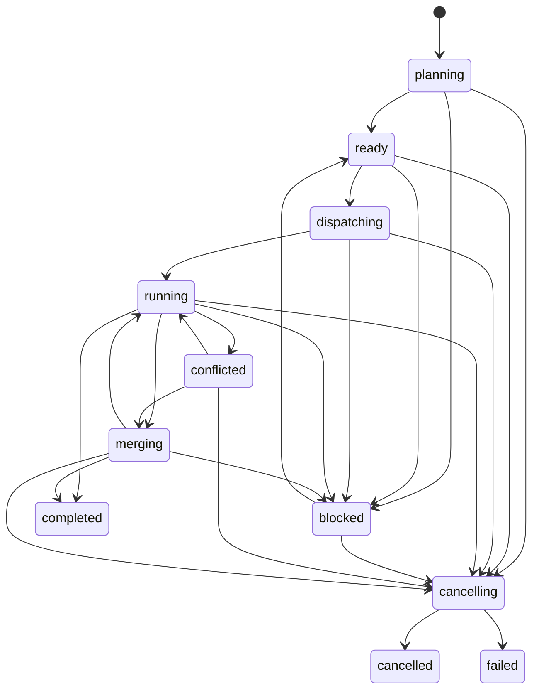

# ADR-0037: Governed multi-agent orchestration contract

## Status

Proposed (2026-06-11). Defines the additive parent/child orchestration contract for
Epic [#435](https://github.com/oscharko-dev/Keiko/issues/435), starting with Issue
[#436](https://github.com/oscharko-dev/Keiko/issues/436).

## Context

Keiko's shipped harness contract is intentionally single-run. `createSession()` yields one
`runId`, one `RunResult`, one event stream, and one cancellation path. That model is stable
and must remain backward compatible, but it is not sufficient for governed multi-agent work
where one parent run plans, dispatches, blocks, settles, and evidences multiple child runs.

Epic #435 requires the system to model:

- explicit parent and child run identities
- deterministic lifecycle states for planning, dispatch, running, blocking, conflict, merge,
  cancellation, and terminal completion
- role assignment and parent-granted authority boundaries
- dependency-aware execution ordering with future parallel eligibility
- child outcome semantics that distinguish accepted, partial, discarded, cancelled, and escalated
  results

The contract must be shared across harness, server, SDK, evidence, and UI consumers without
introducing a second competing state model.

## Decision

### 1. One additive orchestration contract in `@oscharko-dev/keiko-contracts`

The authoritative multi-agent contract lives in
[`packages/keiko-contracts/src/orchestration.ts`](../../packages/keiko-contracts/src/orchestration.ts)
and is re-exported through both `@oscharko-dev/keiko-contracts` and `@oscharko-dev/keiko-harness`.
The single-run harness contract remains intact; orchestration is an additive surface, not a
replacement.

### 2. Parent/child run kinds are explicit

The closed `OrchestrationRunKind` set is:

- `single-run`
- `parent-run`
- `child-run`

This preserves current single-run semantics while giving downstream code a stable way to
represent orchestration lineage without overloading existing harness state names.

### 3. Lifecycle semantics are modeled as a deterministic state machine

The closed `OrchestrationState` set is:

- `planning`
- `ready`
- `dispatching`
- `running`
- `blocked`
- `conflicted`
- `merging`
- `cancelling`
- `completed`
- `cancelled`
- `failed`

Terminal states are `completed`, `cancelled`, and `failed`.

Allowed transitions are intentionally explicit and centrally defined in
`ORCHESTRATION_ALLOWED_STATE_TRANSITIONS`; invalid jumps are rejected by the deterministic helper
`assertOrchestrationStateTransition()`.

### 4. Role and authority boundaries are first-class contract members

Each child plan carries:

- a closed `OrchestrationChildRole`
- a `TaskType`
- an `OrchestrationAuthorityBoundary`
- dependency edges (`dependsOn`)

The initial role set is deliberately narrow:

- `planner`
- `implementer`
- `reviewer`
- `validator`
- `merger`

The authority boundary records allowed task types plus whether a child may read or write the
workspace, spawn children, cancel siblings, approve settlement, and how much concurrency or retry
budget the parent granted.

### 5. Child outcomes distinguish execution from settlement

The closed `OrchestrationChildOutcome` set is:

- `succeeded`
- `partial-success`
- `discarded`
- `cancelled`
- `escalated`
- `failed`

This avoids conflating "the child ran" with "the parent accepted the result." Settlement remains a
first-class parent concern for downstream issues.

## Downstream reliance

The following epic children may now rely on this contract without redefining the vocabulary:

- `#437` may implement deterministic scheduling against `OrchestrationPlan`,
  `OrchestrationExecutionMode`, and the lifecycle states.
- `#438` may attach resource claims and conflict guards to `blocked` and `conflicted`.
- `#439` may implement result settlement using `OrchestrationChildSettlement`,
  `OrchestrationChildOutcome`, and `merging`.
- `#440` may expose parent/child status and transitions through API, SSE, and SDK surfaces.
- `#441` may render orchestration state and child-role lineage in operator-facing UI.
- `#442` may prove invalid transitions are rejected and that single-run compatibility holds.

## Backward-compatibility notes

- No existing single-run `HarnessStateName`, `RunResult`, or `HarnessEvent` member is renamed.
- No existing harness terminal-state semantics are widened or weakened.
- Orchestration types are additive and opt-in for new parent/child flows.
- Current single-agent callers can ignore the new exports without behavioral change.

## Deferred questions

This ADR intentionally does not decide:

- scheduler policy or concurrency algorithms
- resource-lock or patch-conflict implementation
- merge heuristics or ranking of competing child results
- API route shapes, SSE event payloads, or UI layout details
- durable evidence schema changes for orchestration-specific manifests

Those decisions belong to issues `#437` through `#442`, but they must reuse this contract.

## Consequences

### Positive

- One authoritative vocabulary now exists for parent/child orchestration.
- Invalid lifecycle transitions are testable and rejectable by shared code.
- Role policy, conflict handling, settlement, API exposure, and UI work can proceed independently
  without reinterpreting state names.
- Single-run compatibility remains explicit rather than implied.

### Negative

- The contract introduces new terminology that downstream packages must adopt consistently.
- Evidence and UI layers still need follow-up work before operators can fully inspect the model.

## Date

2026-06-11
